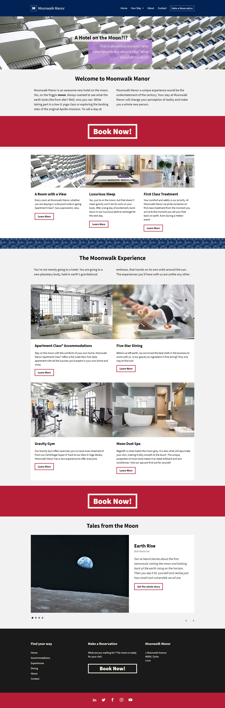

<h2>नमस्ते (Namaste):rabbit:, I'm Shreyansh Kumar Singh! </h2>

<em>ツ Î£Ï€É¢Î¹Ï€ÎµÎµÑ â™› ᒪᕮᗩᖇá‘ᕮᖇ â™ Gâ“ⓜⓔⓡ ✘ A Ê€ ✠ɪ ꜱ ✠ 
</em>

# A Hotel on the Moon!

- [Webpage Link](https://guru-shreyansh.github.io/Linkedin-Learning_ES6_JavaScript-Essential-Training/A-Hotel-on-the-Moon/index.html)

`Linked.In Learning Course: Javascript Essential Training`

## A Hotel on the Moon! : [OUTPUT :last_quarter_moon_with_face: Link](https://guru-shreyansh.github.io/Linkedin-Learning_ES6_JavaScript-Essential-Training/A-Hotel-on-the-Moon/index.html)

| A Hotel on the Moon! | A Hotel on the Moon!! |
| ------------- | ------------- |
|  |  |

<em><b>I love connecting with different people</b> so if you want to say <b>Hi, I'll be happy to meet you!</b> 😊</em>
