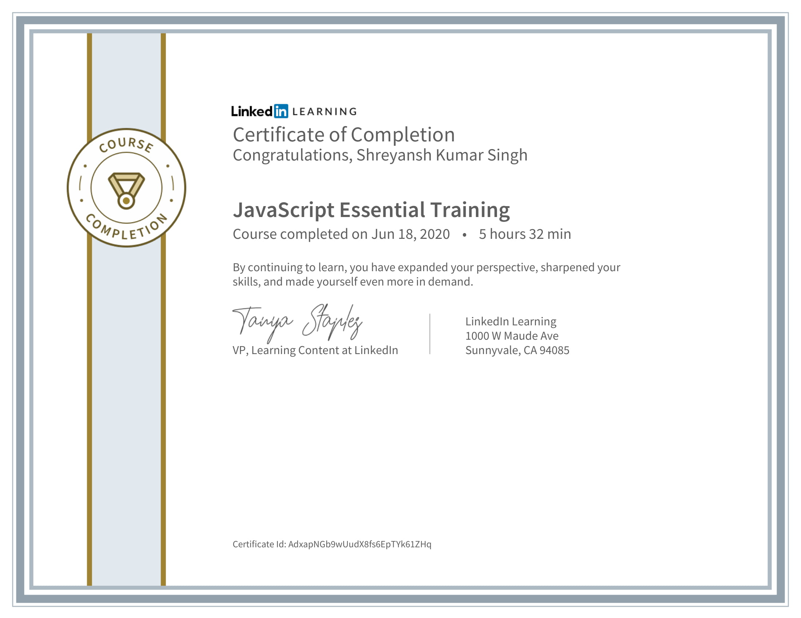
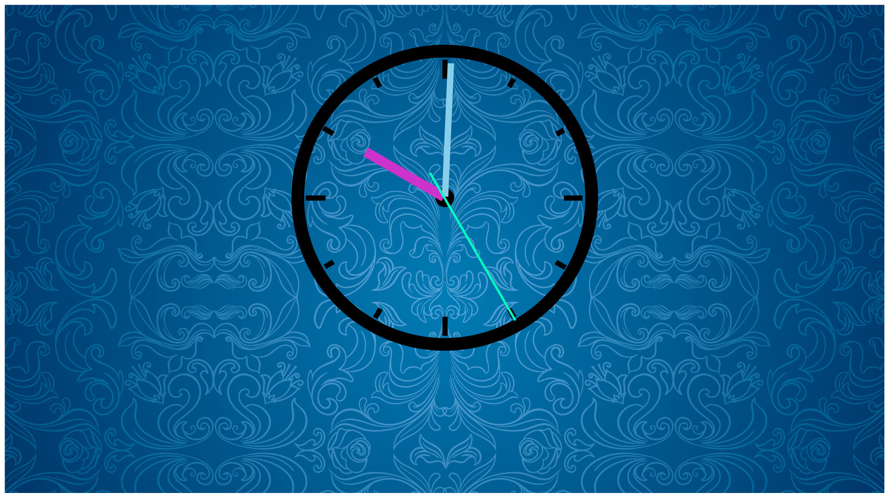
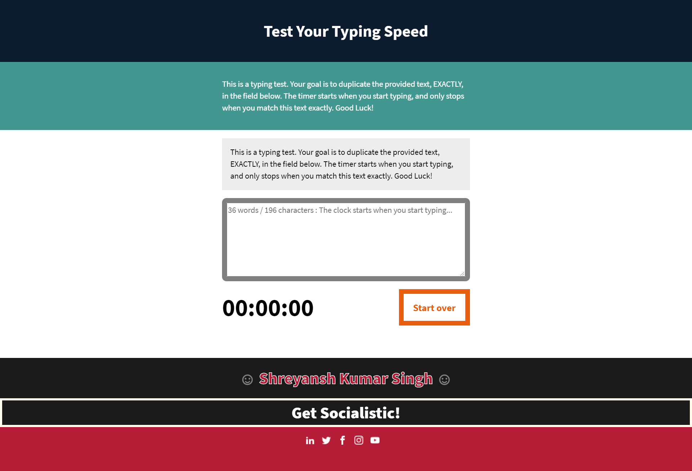
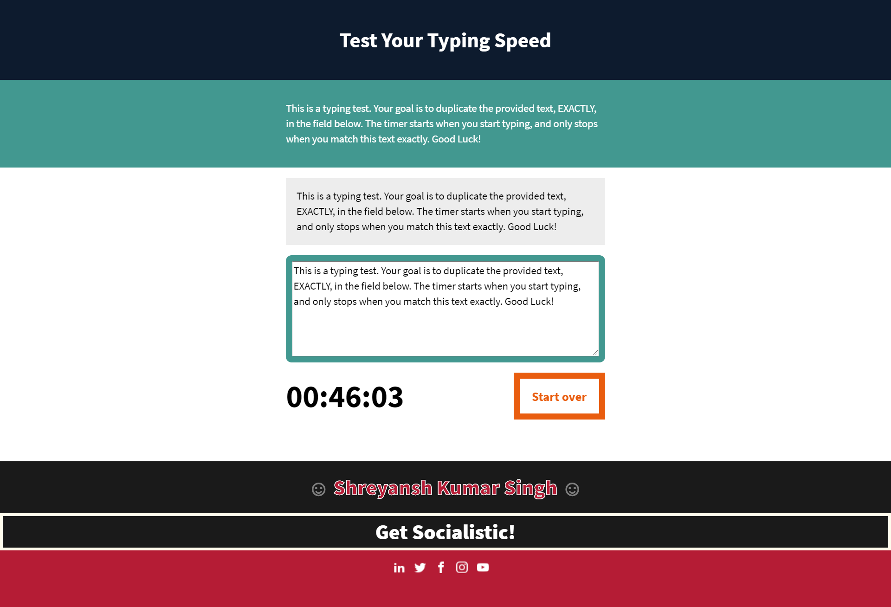
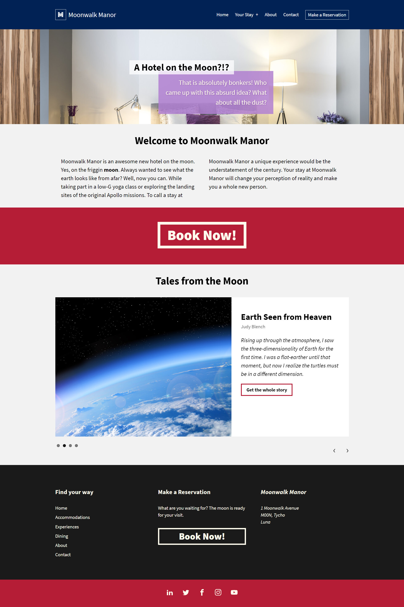

<h2>नमस्ते (Namaste):rabbit:, I'm Shreyansh Kumar Singh! </h2>

<em>ツ Σπɢιπεεя ♛ ᒪᕮᗩᖇᑎᕮᖇ ♞ Gⓐⓜⓔⓡ ✘ A ʀ ✞ ɪ ꜱ ✞  
</em>

## Linked.In Learning :: ES6 JavaScript Essential Training

`Linkedin Course: JavaScript Essential Training by Morten Rand-Hendriksen`

- [Analog Clock Output Screen](#analog-clock-output-screen)
- [Typing Speed Tester]#(typing-speed-tester)
- [Hotel Moon](#hotel-moon)

>`C`
>`E`
>`R`
>`T`
>`I`
>`F`
>`I`
>`C`
>`A`
>`T`
>`E`

* **Analog Clock** : [Analog Clock](https://guru-shreyansh.github.io/Linkedin-Learning_ES6_JavaScript-Essential-Training/Analog-Clock/Analog-Clock.html)

`Free Online Clock`
* **Typing Speed Tester** : [Typing Speed Tester](https://guru-shreyansh.github.io/Linkedin-Learning_ES6_JavaScript-Essential-Training/+Typing-Speed-Tester+/Typing-Speed-Tester.html)

`Test Your Typing Speed`
* **A Hotel on the Moon!** : [A Hotel on the Moon!](https://guru-shreyansh.github.io/Linkedin-Learning_ES6_JavaScript-Essential-Training/A-Hotel-on-the-Moon/index.html)

`Hotel Website`

## Analog Clock Output Screen

## Typing Speed Tester Output Screen
| Typing Speed | Typing Test |
| ------------- | ------------- |
|  |  |

## Hotel Moon Output Screen

<em><b>I love connecting with different people</b> so if you want to say <b>Hi, I'll be happy to meet you!</b> 😊</em>

> #JavaScript #HTML5 #CSS3 #JS #Frontend #Linkedin #WebApp #Projects

#### < Get Socialistic >
➧ [Facebook](https://www.facebook.com/guru.shreyansh)
➧ [Instagram](https://www.instagram.com/guru_shreyansh)
➧ [Twitter](https://twitter.com/GURU_Shreyansh)

## :octocat: @GURU-Shreynash :octocat:
